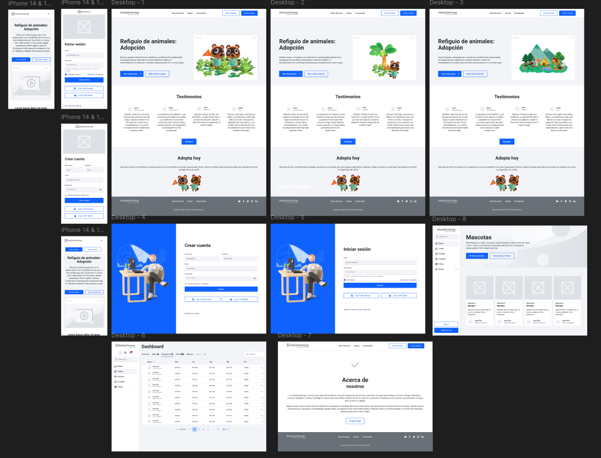

# Objetivo del proyecto:
Facilitar la adopción de animales de refugios, conectando a personas interesadas en adoptar con refugios locales.

## Público objetivo:
Personas interesadas en adoptar mascotas, defensores de los animales, y refugios que buscan una plataforma para promover sus animales.

## Principales desafíos o limitaciones:
- Asegurar que los animales sean adoptados por hogares responsables.
- Integración con bases de datos de refugios de animales.
- Garantizar la visibilidad de todos los animales en la plataforma.

## Detalles del estudio de investigación:
- Estudio de comportamiento del usuario para entender qué información buscan los adoptantes potenciales.
- Análisis de plataformas de adopción existentes para identificar áreas de mejora.
- Colaboración con refugios para conocer sus necesidades y procesos.

## Conceptos de diseño iniciales:
- Perfiles detallados para cada animal, con fotos y descripciones.
- Filtros de búsqueda para facilitar la búsqueda de mascotas específicas.
- Sistema de solicitud de adopción en línea.