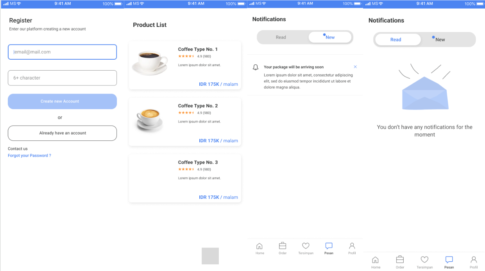

# Objetivo del proyecto:
Crear una plataforma en línea donde los usuarios puedan compartir y descubrir reseñas de cafeterías, fomentando una comunidad de entusiastas del café.

## Público objetivo:
Amantes del café, críticos gastronómicos, turistas y locales interesados en descubrir nuevas cafeterías.

## Principales desafíos o limitaciones:

- Garantizar la autenticidad de las reseñas.
- Mantener la seguridad de los datos de los usuarios.
- Escalar la plataforma para manejar un gran volumen de usuarios y reseñas.

## Detalles del estudio de investigación:

- Investigación de mercado para identificar las cafeterías más populares y los competidores existentes.
- Encuestas a posibles usuarios para entender sus necesidades y expectativas.
- Análisis de usabilidad para optimizar la experiencia del usuario.

## Conceptos de diseño iniciales:
- Interfaz minimalista y fácil de navegar.
- Sistema de calificación intuitivo.
- Mapa interactivo para encontrar cafeterías cercanas.