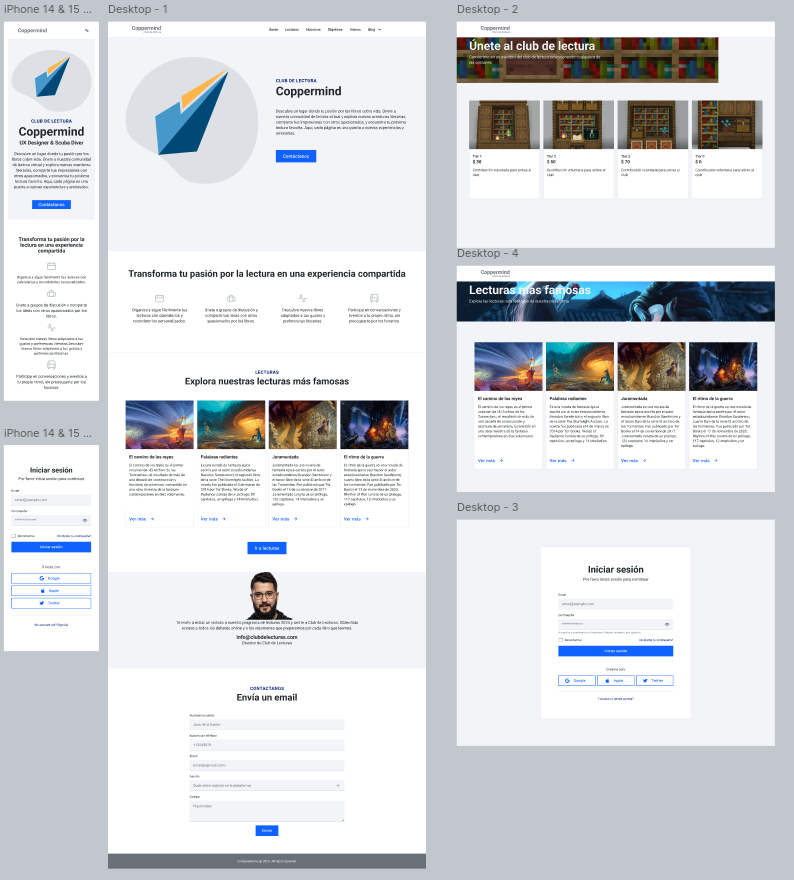

# Objetivo del proyecto:
Crear un espacio en línea donde los usuarios puedan unirse a un club de lectura, participar en discusiones y acceder a recomendaciones de libros populares.

## Público objetivo:
Amantes de la lectura, personas buscando conectarse con otros lectores, y aquellos interesados en recomendaciones literarias.

## Principales desafíos o limitaciones:
- Mantener la interacción y participación activa de los usuarios.
- Garantizar la accesibilidad de la plataforma en diferentes dispositivos.
- Proteger la privacidad y seguridad de los datos de los usuarios.

## Detalles del estudio de investigación:
- Análisis de comportamiento de lectores para entender qué géneros y formatos son más populares.
- Encuestas para identificar las principales motivaciones para unirse a un club de lectura.
- Estudio de plataformas similares para identificar características clave.

## Conceptos de diseño iniciales:
- Interfaz atractiva con secciones para discusiones, recomendaciones y eventos.
- Notificaciones personalizadas sobre nuevas lecturas y actividades del club.
- Sistema de perfiles de usuario que permite conectar con otros lectores.